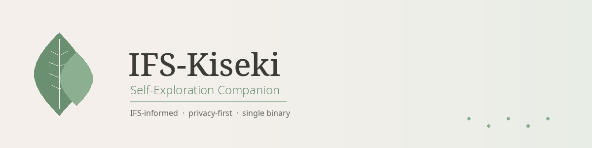

<p align="center">
  
</p>

<p align="center">
  <strong>A private, IFS-informed self-exploration companion that runs on your machine.</strong><br>
  Single Go binary. Local data. Cloud LLM. No subscriptions, no servers, no accounts.
</p>

<p align="center">
  <a href="#quick-start">Quick Start</a> ·
  <a href="#features">Features</a> ·
  <a href="#configuration">Configuration</a> ·
  <a href="#architecture">Architecture</a> ·
  <a href="#crisis-safety">Crisis Safety</a>
</p>

---

## What Is IFS-Kiseki?

IFS-Kiseki is a standalone companion for [Internal Family Systems](https://ifs-institute.com/) self-exploration. It runs entirely on your machine as a small HTTP server that opens in your browser. Your conversations are stored in a local SQLite database — nothing leaves your machine except the messages you send to the LLM provider you choose.

The companion is grounded in IFS principles: it speaks in parts language, guides you through the 6 F's protocol, checks for Self-energy before going deeper, and never rushes toward exile work. It is warm, patient, and knowledgeable — not a chatbot reading a manual.

**It is not therapy.** It is a tool for self-reflection, built by people who believe that understanding your inner world should be accessible, private, and safe.

---

## Features

🧠 **IFS-Informed Companion** — Deep knowledge of the 6 F's protocol, parts taxonomy (managers, firefighters, exiles), Self-energy (8 C's and 5 P's), unblending techniques, and session flow. The system prompt is sourced from IFS literature and crafted to feel like a warm, knowledgeable guide.

💬 **Real-Time Streaming Chat** — Responses appear word-by-word via WebSocket. Supports Claude (Anthropic) and Grok (xAI) as LLM providers.

🧩 **Session Memory** — Past sessions are saved locally and used to generate warm, contextual briefings at the start of each new conversation. Optional vector embeddings (via Ollama) enable semantic search across your history.

🛡️ **Crisis Safety** — Keyword-based detection scans every message before it reaches the LLM. When crisis language is detected, a resource overlay with hotline information appears and cannot be dismissed for 5 seconds. This is non-negotiable — it ships enabled by default.

🔒 **Privacy-First** — All data stays on your machine in a local SQLite database. The only outbound connections are to the LLM provider API you configure. Config files are stored with restrictive permissions (0600).

🎨 **Warm, Therapy-Appropriate UI** — A clean web interface with dark mode support, designed to feel safe and grounding — not clinical, not flashy.

📋 **Session History** — Browse past sessions in the sidebar, resume previous conversations, and track your exploration over time.

⚙️ **Configurable Companion** — Name your companion, set focus areas (anxiety, perfectionism, relationships, etc.), add custom instructions, and switch providers at any time.

---

## Quick Start

### Prerequisites

- **Go 1.22+** and a **C compiler** (for SQLite via CGO)
- An API key from [Anthropic](https://console.anthropic.com/) (Claude) or [xAI](https://console.x.ai/) (Grok)

### 1. Clone and Build

```bash
git clone https://github.com/Gsirawan/ifs-kiseki.git
cd ifs-kiseki
make build
```

Or build directly:

```bash
CGO_ENABLED=1 go build -ldflags "-X main.Version=0.1.0" -o ifs-kiseki .
```

### 2. Set Your API Key

Choose one:

```bash
# Option A: Environment variable (recommended)
export ANTHROPIC_API_KEY="sk-ant-..."

# Option B: .env file
cp .env.example .env
# Edit .env and add your key
```

### 3. Run

```bash
./ifs-kiseki
```

The server starts at `http://127.0.0.1:3737` and opens your browser automatically. On first launch, you'll see a disclaimer and onboarding flow.

### Make Targets

| Target | Description |
|--------|-------------|
| `make build` | Compile the binary with version info |
| `make run` | Build and run |
| `make test` | Run all tests |
| `make dev` | Run with `go run` (no binary on disk) |
| `make clean` | Remove binary and local database |

---

## Screenshots

> Screenshots coming soon. Here's what you'll see:

- **Onboarding** — A warm disclaimer and API key setup flow on first launch
- **Chat** — A clean conversation interface with streaming responses and IFS-informed guidance
- **Sidebar** — Session history with duration indicators and a briefing card
- **Crisis Overlay** — A non-dismissible resource panel that appears when crisis language is detected
- **Settings** — Provider selection, companion customization, and theme preferences

---

## Architecture

```
+------------------------------------------------------------------+
|                        IFS-KISEKI BINARY                         |
|                                                                  |
|  +------------------+    +------------------+    +-----------+   |
|  |   HTTP Server    |    |  WebSocket Hub   |    | embed.FS  |   |
|  |  (localhost:NNN) |--->|  (streaming chat) |    | (SPA UI)  |   |
|  +--------+---------+    +--------+---------+    +-----+-----+   |
|           |                       |                    |          |
|           v                       v                    v          |
|  +------------------+    +------------------+    +-----------+   |
|  |   REST API       |    |   Chat Engine    |    | Static    |   |
|  |  /api/sessions   |    |  - turn mgmt     |    | Assets    |   |
|  |  /api/settings   |    |  - prompt build   |    | HTML/CSS  |   |
|  |  /api/briefing   |    |  - stream relay   |    | /JS       |   |
|  +--------+---------+    +--------+---------+    +-----------+   |
|           |                       |                              |
|           v                       v                              |
|  +------------------+    +------------------+                    |
|  |   Memory Engine  |    | Provider Layer   |                    |
|  |  (Kiseki-lite)   |    |                  |                    |
|  |  - save session  |    | +-------------+  |                    |
|  |  - search context|    | | Anthropic   |  |                    |
|  |  - gen briefing  |    | | Client      |  |                    |
|  |  SQLite + Vec    |    | | (Claude)    |  |                    |
|  |  + Ollama embed  |    | +-------------+  |                    |
|  +------------------+    | +-------------+  |                    |
|                          | | OpenAI-     |  |                    |
|                          | | Compatible  |  |                    |
|                          | | Client      |  |                    |
|                          | | (Grok/xAI)  |  |                    |
|                          | +-------------+  |                    |
|                          +------------------+                    |
|                                                                  |
|  +------------------+    +------------------+                    |
|  |   Config         |    |  Crisis Safety   |                    |
|  |  config.json     |    |  - keyword scan  |                    |
|  |  API keys        |    |  - resource show  |                    |
|  |  provider choice |    |  - disclaimer    |                    |
|  +------------------+    +------------------+                    |
+------------------------------------------------------------------+
         |                          |
         v                          v
   +-----------+            +---------------+
   | SQLite DB |            | Cloud APIs    |
   | (local)   |            | - Anthropic   |
   | sessions  |            | - xAI (Grok)  |
   | messages  |            | - Ollama      |
   | embeddings|            |   (embeddings)|
   +-----------+            +---------------+
```

**Key design decisions:**

- **Single binary** — The web UI is embedded via Go's `embed.FS`. No separate frontend build step, no Node.js, no npm.
- **Two API clients cover all providers** — The Anthropic client handles Claude; the OpenAI-compatible client handles Grok and any future provider (Ollama, GPT, Groq, etc.).
- **Graceful degradation** — Every optional component (embeddings, memory, crisis detection) degrades gracefully when unavailable. The app always starts.
- **Crisis detection runs before the LLM** — Messages are scanned locally before being sent to the provider. No network dependency for safety.

---

## Configuration

Config is stored at `~/.config/ifs-kiseki/config.json` (respects `XDG_CONFIG_HOME`). On first run, a default config is created automatically.

See [`config.example.json`](config.example.json) for the full schema.

### Top-Level

| Field | Type | Default | Description |
|-------|------|---------|-------------|
| `version` | int | `1` | Config schema version |
| `provider` | string | `"claude"` | Active provider: `"claude"` or `"grok"` |
| `disclaimer_accepted` | bool | `false` | Set automatically after first-launch acceptance |

### Providers

#### `providers.claude`

| Field | Default | Description |
|-------|---------|-------------|
| `model` | `"claude-sonnet-4-20250514"` | Model ID |
| `base_url` | `"https://api.anthropic.com"` | API endpoint |
| `max_tokens` | `4096` | Max tokens per response |
| `temperature` | `0.7` | Sampling temperature |
| `api_key` | `""` | API key (prefer env var `ANTHROPIC_API_KEY`) |

#### `providers.grok`

| Field | Default | Description |
|-------|---------|-------------|
| `model` | `"grok-4-1-fast-reasoning"` | Model ID |
| `base_url` | `"https://api.x.ai"` | API endpoint |
| `max_tokens` | `4096` | Max tokens per response |
| `temperature` | `0.7` | Sampling temperature |
| `api_key` | `""` | API key (prefer env var `XAI_API_KEY`) |

### Embeddings

| Field | Default | Description |
|-------|---------|-------------|
| `ollama_host` | `"localhost:11434"` | Ollama server address |
| `model` | `"qwen3-embedding:0.6b"` | Embedding model |
| `dimension` | `1024` | Vector dimension |

### Server

| Field | Default | Description |
|-------|---------|-------------|
| `host` | `"127.0.0.1"` | Bind address (localhost only) |
| `port` | `3737` | HTTP port |
| `open_browser` | `true` | Auto-open browser on start |

### Companion

| Field | Default | Description |
|-------|---------|-------------|
| `name` | `"Kira"` | Companion display name |
| `focus_areas` | `["anxiety", "perfectionism"]` | IFS focus areas |
| `user_name` | `""` | Your name (optional) |
| `custom_instructions` | `""` | Additional prompt instructions |

### Crisis

| Field | Default | Description |
|-------|---------|-------------|
| `enabled` | `true` | Enable crisis detection |
| `hotline_country` | `"US"` | Country code for resource display |

### Memory

| Field | Default | Description |
|-------|---------|-------------|
| `auto_save` | `true` | Save sessions automatically |
| `briefing_on_start` | `true` | Generate briefing from past sessions |
| `max_context_chunks` | `5` | Memory chunks included in context |

### UI

| Field | Default | Description |
|-------|---------|-------------|
| `theme` | `"warm"` | UI theme |
| `font_size` | `"medium"` | `"small"`, `"medium"`, or `"large"` |

---

## Providers

### Claude (Recommended)

Claude is the default and recommended provider for IFS self-exploration. Its conversational depth and emotional attunement make it well-suited for parts work.

1. Get an API key at [console.anthropic.com](https://console.anthropic.com/)
2. Set it via environment variable:
   ```bash
   export ANTHROPIC_API_KEY="sk-ant-..."
   ```
   Or in `.env`:
   ```bash
   ANTHROPIC_API_KEY=sk-ant-...
   ```

### Grok (Premium Alternative)

Grok (xAI) is a premium alternative with strong therapeutic presence. It uses an OpenAI-compatible API.

1. Get an API key at [console.x.ai](https://console.x.ai/)
2. Set it via environment variable:
   ```bash
   export XAI_API_KEY="xai-..."
   ```

To switch providers, change `"provider"` in config.json to `"grok"`, or use the Settings page in the UI.

---

## Embeddings (Optional)

Session memory works without embeddings — sessions are saved and retrieved by recency. Embeddings add **semantic search**, surfacing relevant context from older conversations based on meaning rather than time.

### Setup

1. Install [Ollama](https://ollama.com/)
2. Pull the embedding model:
   ```bash
   ollama pull qwen3-embedding:0.6b
   ```
3. Start Ollama:
   ```bash
   ollama serve
   ```

Ollama runs at `localhost:11434` by default — no further configuration needed.

**If Ollama is not running**, IFS-Kiseki starts normally and falls back to recency-based memory. Sessions are still saved; embeddings are simply skipped. When you start Ollama later, new sessions will be embedded automatically.

---

## Environment Variables

API keys and the Ollama host can be set via environment variables. These **always take precedence** over config.json values.

```bash
cp .env.example .env
# Edit .env with your values
```

| Variable | Description |
|----------|-------------|
| `ANTHROPIC_API_KEY` | Anthropic API key for Claude |
| `XAI_API_KEY` | xAI API key for Grok |
| `OLLAMA_HOST` | Ollama server address (default: `localhost:11434`) |

---

## Crisis Safety

IFS-Kiseki includes keyword-based crisis detection that scans every message **before** it reaches the LLM. When crisis language is detected, a resource overlay appears with country-specific hotline information. The overlay cannot be dismissed for 5 seconds.

**Supported countries:** US, GB, CA, AU, NZ, DE, FR, IN, AE — with automatic fallback to US resources.

Crisis detection is enabled by default and **should not be disabled**. It can be turned off in config (`crisis.enabled: false`), but this is strongly discouraged.

> **This feature is not a substitute for professional crisis support.** If you or someone you know is in crisis, please contact a qualified professional or emergency services immediately.

---

## Data & Privacy

- All data is stored locally at `~/.config/ifs-kiseki/ifs-kiseki.db`
- Config is stored at `~/.config/ifs-kiseki/config.json` with permissions `0600`
- The **only** outbound connections are to your configured LLM provider API and (optionally) local Ollama
- No telemetry, no analytics, no tracking
- Your conversations never leave your machine except as LLM API requests to the provider you chose

---

## Disclaimer

**IFS-Kiseki is not therapy and is not a substitute for professional mental health care.**

It is a self-exploration tool informed by Internal Family Systems principles. It cannot diagnose, treat, or provide clinical advice. The companion is not a licensed therapist, counselor, or medical professional.

For deep trauma work, complex PTSD, dissociative experiences, or any situation where you feel unsafe, please work with a [trained IFS therapist](https://ifs-institute.com/practitioners).

If you are experiencing a mental health crisis, contact emergency services or a crisis hotline in your country.

By using IFS-Kiseki, you acknowledge that you are using it as a personal reflection tool, not as a therapeutic intervention.

---

## Tech Stack

| Component | Technology |
|-----------|------------|
| Backend | Go (single binary, `embed.FS` for static assets) |
| Database | SQLite + [sqlite-vec](https://github.com/asg017/sqlite-vec) (vector search) |
| Embeddings | [Ollama](https://ollama.com/) (local, optional) |
| Frontend | Vanilla HTML/CSS/JS (no build step, no framework) |
| LLM Providers | Anthropic API (Claude), OpenAI-compatible API (Grok/xAI) |
| WebSocket | [nhooyr.io/websocket](https://github.com/nhooyr/websocket) |

---

## License

MIT License — see [LICENSE](LICENSE).

---

## Contributing

Contributions are welcome. If you're interested in contributing, please:

1. Open an issue to discuss the change before submitting a PR
2. Follow the existing code style and conventions
3. Include tests for new functionality
4. Do not modify the IFS Protocol prompt (`internal/chat/prompt_ifs.go`) without discussion — it is carefully sourced from IFS literature

---

<p align="center">
  <sub>Built with care for people who want to understand themselves better.</sub>
</p>
